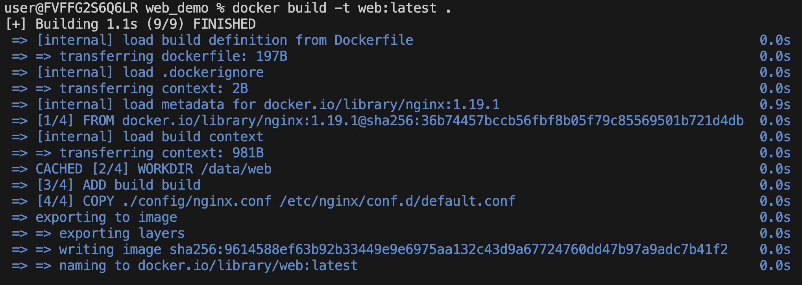
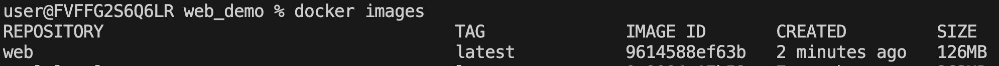
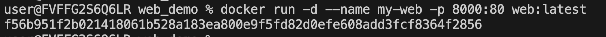
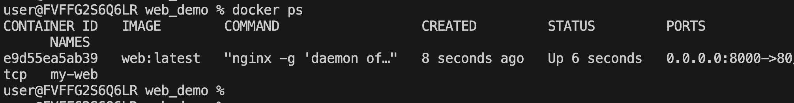

# 使用Docker部署前端

### 1.创建Dockerfile

在项目跟目录下创建Dockerfile文件：  

```dockerfile
# 使用nginx作为基础镜像
FROM nginx:1.19.1

# 指定工作空间
WORKDIR /data/web

# 将 yarn build 打包后的build文件夹添加到工作空间
ADD build build

# 将项目必要文件添加到工作空间，这里我们把nginx配置文件维护在项目里，部署时直接移动配置文件，就不需要在去处理nginx配置了
COPY ./scripts/run.sh ./
COPY ./config/nginx.conf /etc/nginx/conf.d/default.conf

# 暴露80端口
EXPOSE 80
ENTRYPOINT ["sh", "./run.sh"]  
```

### 2.打包项目代码
```shell
yarn build
```

### 3.打包镜像

打包最新镜像，镜像名为web，tag为latest
```shell
docker build -t web:latest . 
```



查看打包好的镜像
```shell
docker images 
```




### 4.启动容器

使用镜像web:latest启动容器，容器名称为my-web，端口映射到8000
```shell
docker run -d --name my-web -p 8000:80 web:latest
```




查看运行中的容器
```shell
docker ps
```




最后直接在浏览器打开 ip:8000，就可以看到web页面了